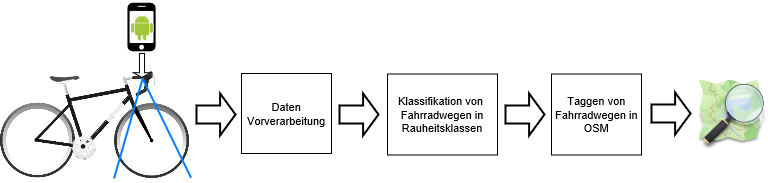
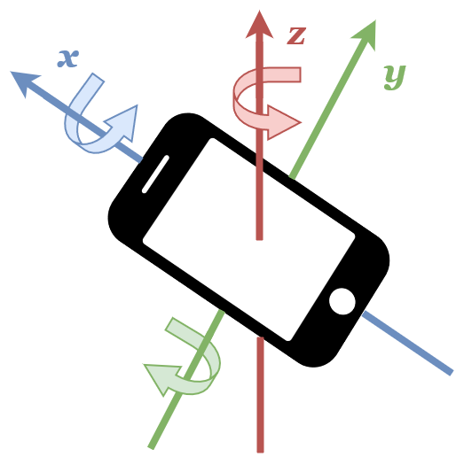

# Klassifizierung von Fahrradwegen mit Hilfe von Faltungsnetzwerken : Python Repository

## Einleitung

In diesem Repository befinden sich Jupyter Notebboks, in welchem die aufgenommenen Daten von der [Fahrradwege-Monitoring-App](https://github.com/SandGreif/Fahrradwege-Monitoring-App) weiterverarbeitet werden. Wie in Abb. 1 der funktionalen Architektur zu sehen werden Daten mit einer Android App erfasst. Im nächsten Schritt erfolgt dann die Vorverarbeitung der Rohdaten, Klassifizierung von Fahrradwegen sowie das Taggen dieser für OpenStreetMap(OSM).

Abbildung 1: Funktionale Architektur

## Daten die von der App erfasst werden.

Von der Fahrradwege-Monitoring-App werden kontinuierlich Fotos aufgenommen im Schnitt ca. 3 Bilder pro Sekunde. Die aufgenommenen Bilder werden nur abgespeichert, wenn die Geschwindigkeit zwischen 5 und 25 km/h liegt. Mit der Begrenzung soll verhindert werden, dass Bilder von Fahrradwegen im Stand verarbeitet werden oder zu unscharf werden durch Bewegungsunschärfe. In Abb. 1 ist zu sehen, dass das Smartphone bei den meisten aufgenommen Daten bzw. Datensätzen an der rechten Seite des Lenkers montiert war. Für den Benutzer ist so eine bequeme Bedienung der App möglich. Ein Nachteil ist der relativ große Abstand zum Boden mit ca. 97cm. Ein Datensatz setzt sich zusammen aus Bildaufnahmen und Messwerten einer gefahrenen Route. Weitere Informationen zu den Datensätzen befinden sich in den Ordner daten/beschreibung_der_datensaetze.xlsx.

Abbildung 2: Android Smartphone Sensor Orientierung

Auf der Abb. 2 ist die generelle Sensor Orientierung von Smartphones zu sehen. Diese besteht aus den 3-Achsen X,Y und Z. Zusätzlich sind noch die Roll-Nick-Gier Winkel eingezeichnet. Auf der X-Achse befindet sich der Roll-Winkel. Dann ist auf der Y-Achse der Nick-Winkel und auf der Z-Achse der Gier-Winkel. In der Tab. 1 sind die Messwerte beschrieben die zu einer Bildaufnahme erfasst werden.
Dazu werden noch Zeitstempel aufgenommen und die Unixzeit in ms als ID-Nummer, wenn ein Bild abgespeichert wird.

Type | Sensor |
--- | --- |
Geschwindigkeit in km/h | GPS
Breitengrad in Dezimalgrad | GPS
Längengrad in Dezimalgrad | GPS
X,Y,Z-Achsen Beschleunigung in m/s^2 | 3-Achsen Beschleunigungssensor
Roll-Nick-Gier Winkel in rad | 3-Achsen Beschleunigungssensor und Magnetometer
Tabelle 1: Messwerte die von der Fahrradwege-Monitoring-App erfasst werden

## Bildverzeichnis

Abb. 1  Funktionale Architektur, Grafik erstellt mit folgenden Werken:
- Google Inc., Android Robot,   Creative-Commons-Lizenz(https://de.wikipedia.org/wiki/Creative_Commons), Änderung:  Bild in einer Abbildung zusammengestellt
 - Uyen, Smartphone icon, The Noun Project, Creative-Commons-Lizenz(https://de.wikipedia.org/wiki/Creative_Commons)
- Ken Vermette, , Logo des OpenStreetMap-Projekts, https://de.wikipedia.org/wiki/Datei:Openstreetmap_logo.svg, Creative-Commons-Lizenz(https://de.wikipedia.org/wiki/Creative_Commons)

Abb. 2  Android Smartphone Sensor Orientierung, Verwendetes Werk:
- Uyen, Smartphone icon, The Noun Project, Creative-Commons-Lizenz(https://de.wikipedia.org/wiki/Creative_Commons)
